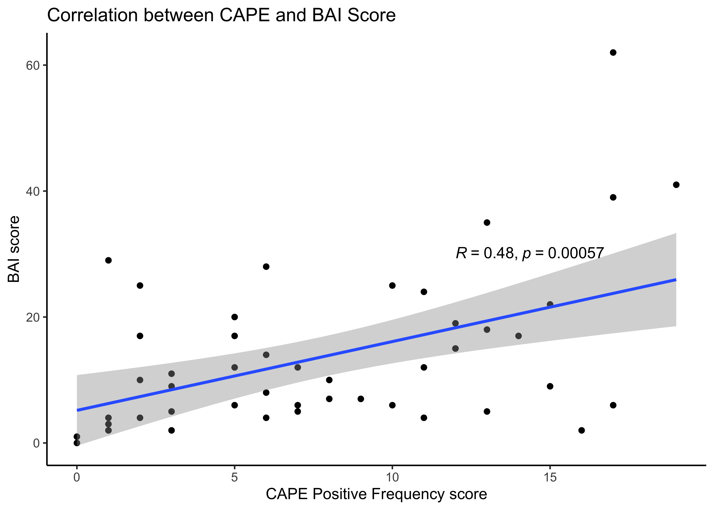
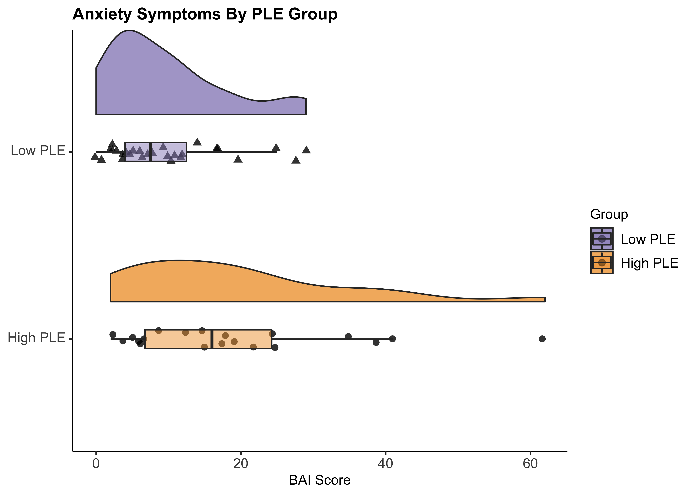
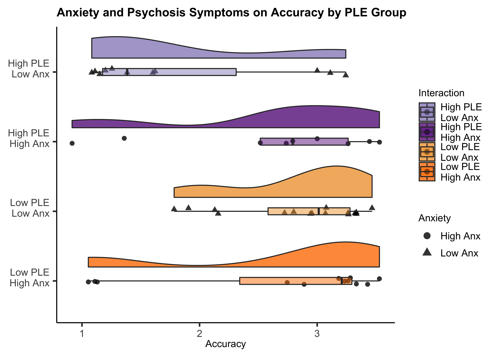

NCP\_anxiety\_analysis
================
Jadyn Park
1/20/2021

**Research Questions:**  
**1.** Do High-NCP and Low-NCP groups perform differently in a cognitive
task?  
**2.** Are clinically relevant traits/symptoms (i.e., anxiety) related
to the difference in group performance?  
**3.** Do relevant traits contribute to perseveration errors in implicit
learning tasks?

**Research Aims:**  
**Aim 1.** To test group differences in cognitive performance (accuracy,
efficiency) in Low vs. High NCP  
**Aim 2.** To test if group performance is related to clinically
relevant traits (e.g., anxiety)  
**Aim 3.** To test if relevant traits are correlated with perseveration
errors in a rule-learning task

**Hypotheses:**  
**1.** Low NCPs perform better than high NCPs  
**2.** Greater the BAI (anxiety) scores, worse the performance  
**3.** Low NCPs perseverate less than high NCPs and anxiety symptoms are
correlated with this relationship  
**3.1.** Alternatively, greater anxiety may only affect high NCP but not
low NCP

``` r
#load libraries 
rm(list = ls())
library(knitr); library(kableExtra); library(reshape2); library(tidyverse); library(dplyr); library(effsize);library(rstatix); library(tables); library(ggplot2); library(ggpubr); library(RColorBrewer); library(ez); source("~/Desktop/Anxiety NCP/summarySEwithin2.R"); library(wesanderson); library(forcats)

#import data - demographics, self report, and PCET
data <- read.csv("~/Desktop/Anxiety NCP/raw data/Anxiety_NCP_master.csv", header = TRUE)
```

### Demographics

``` r
# Demographics
demo <- data %>% group_by(Group) %>%
  dplyr::summarise(N = sum(!is.na(Subject.ID)),
            meanAge = round(mean(Age, na.rm = TRUE), 3),
            sdAge = round(sd(Age, na.rm = TRUE), 3),
            meanEd = round(mean(Education, na.rm=T), 3),
            sdEd = round(sd(Education, na.rm=T),3),
            female = sum(Sex == "F"),
            male = sum(Sex == "M"),
            eastAsian = sum(Race == "east asian"),
            white = sum(Race == "white"),
            interracial = sum(Race == "interracial"),
            black = sum(Race == "black"),
  )

demo <- data.frame(t(demo)) # transpose
demo <- demo[2:12,]
colnames(demo) <- c("High NCP", "Low NCP") # column names
rownames(demo) <- c("N", "Mean", "SD", "Education", "Edu SD", "Female", "Male", 
                           "East Asian", "White", "Interracial", "Black") # row names

knitr::kable(format(demo, digits = 3, drop0trailing = TRUE), caption = "Participant Demographics") %>%
  kable_styling(c("striped", full_width = F)) %>%
  pack_rows("Count", 1, 1) %>%
  pack_rows("Age", 2, 3) %>%
  pack_rows("Education", 4, 5) %>% 
  pack_rows("Sex", 6, 7) %>%
  pack_rows("Race", 8, 11) 
```

<table class="table table-striped" style="margin-left: auto; margin-right: auto;">
<caption>
Participant Demographics
</caption>
<thead>
<tr>
<th style="text-align:left;">
</th>
<th style="text-align:left;">
High NCP
</th>
<th style="text-align:left;">
Low NCP
</th>
</tr>
</thead>
<tbody>
<tr grouplength="1">
<td colspan="3" style="border-bottom: 1px solid;">
<strong>Count</strong>
</td>
</tr>
<tr>
<td style="text-align:left; padding-left: 2em;" indentlevel="1">
N
</td>
<td style="text-align:left;">
29
</td>
<td style="text-align:left;">
37
</td>
</tr>
<tr grouplength="2">
<td colspan="3" style="border-bottom: 1px solid;">
<strong>Age</strong>
</td>
</tr>
<tr>
<td style="text-align:left; padding-left: 2em;" indentlevel="1">
Mean
</td>
<td style="text-align:left;">
20.786
</td>
<td style="text-align:left;">
20.056
</td>
</tr>
<tr>
<td style="text-align:left; padding-left: 2em;" indentlevel="1">
SD
</td>
<td style="text-align:left;">
1.95
</td>
<td style="text-align:left;">
1.97
</td>
</tr>
<tr grouplength="2">
<td colspan="3" style="border-bottom: 1px solid;">
<strong>Education</strong>
</td>
</tr>
<tr>
<td style="text-align:left; padding-left: 2em;" indentlevel="1">
Education
</td>
<td style="text-align:left;">
14.462
</td>
<td style="text-align:left;">
14.515
</td>
</tr>
<tr>
<td style="text-align:left; padding-left: 2em;" indentlevel="1">
Edu SD
</td>
<td style="text-align:left;">
3.203
</td>
<td style="text-align:left;">
1.839
</td>
</tr>
<tr grouplength="2">
<td colspan="3" style="border-bottom: 1px solid;">
<strong>Sex</strong>
</td>
</tr>
<tr>
<td style="text-align:left; padding-left: 2em;" indentlevel="1">
Female
</td>
<td style="text-align:left;">
22
</td>
<td style="text-align:left;">
26
</td>
</tr>
<tr>
<td style="text-align:left; padding-left: 2em;" indentlevel="1">
Male
</td>
<td style="text-align:left;">
6
</td>
<td style="text-align:left;">
10
</td>
</tr>
<tr grouplength="4">
<td colspan="3" style="border-bottom: 1px solid;">
<strong>Race</strong>
</td>
</tr>
<tr>
<td style="text-align:left; padding-left: 2em;" indentlevel="1">
East Asian
</td>
<td style="text-align:left;">
6
</td>
<td style="text-align:left;">
4
</td>
</tr>
<tr>
<td style="text-align:left; padding-left: 2em;" indentlevel="1">
White
</td>
<td style="text-align:left;">
7
</td>
<td style="text-align:left;">
22
</td>
</tr>
<tr>
<td style="text-align:left; padding-left: 2em;" indentlevel="1">
Interracial
</td>
<td style="text-align:left;">
3
</td>
<td style="text-align:left;">
3
</td>
</tr>
<tr>
<td style="text-align:left; padding-left: 2em;" indentlevel="1">
Black
</td>
<td style="text-align:left;">
6
</td>
<td style="text-align:left;">
2
</td>
</tr>
</tbody>
</table>

``` r
## significant difference in age?
data <- data[!is.na(data$PCETCR), ]

var.test(data$Age~data$Group)#p>.05, homogeneous sample
```

    ## 
    ##  F test to compare two variances
    ## 
    ## data:  data$Age by data$Group
    ## F = 0.90616, num df = 23, denom df = 32, p-value = 0.8176
    ## alternative hypothesis: true ratio of variances is not equal to 1
    ## 95 percent confidence interval:
    ##  0.4281549 2.0148673
    ## sample estimates:
    ## ratio of variances 
    ##          0.9061556

``` r
age.t <- t.test(data$Age~data$Group, var.equal=T) 

## significant difference in education? 
var.test(data$Education~data$Group) #p<.05, heterogeneous sample
```

    ## 
    ##  F test to compare two variances
    ## 
    ## data:  data$Education by data$Group
    ## F = 3.57, num df = 21, denom df = 30, p-value = 0.001527
    ## alternative hypothesis: true ratio of variances is not equal to 1
    ## 95 percent confidence interval:
    ##  1.638745 8.240206
    ## sample estimates:
    ## ratio of variances 
    ##           3.569958

``` r
edu.t <- t.test(data$Education~data$Group, var.equal=F) # t-test rather than ANOVA because I'm comparing two samples (high vs. low)
```

Conducting Chi-square test to test the independence between two
variables – (1) Group (high vs. low), (2) Sex (M vs. F)

``` r
# Chi-square to test whether group is independent from sex
test <- chisq.test(table(data$Group, data$Sex))
X_squared = test[["statistic"]]; df = test[["parameter"]]; p.value = test[["p.value"]]; method = test[["method"]]
test.frame <- data.frame(X_squared, df, p.value, method)
row.names(test.frame) <- NULL

knitr::kable(format(test.frame, digits = 5, drop0trailing = TRUE), 
             caption = "p-value > .05, Group (High vs. Low) and Sex (M vs. F) are independent") %>% 
             kable_styling(c("striped", "bordered", full_width = F))
```

<table class="table table-striped table-bordered" style="margin-left: auto; margin-right: auto;">
<caption>
p-value &gt; .05, Group (High vs. Low) and Sex (M vs. F) are independent
</caption>
<thead>
<tr>
<th style="text-align:left;">
X\_squared
</th>
<th style="text-align:left;">
df
</th>
<th style="text-align:left;">
p.value
</th>
<th style="text-align:left;">
method
</th>
</tr>
</thead>
<tbody>
<tr>
<td style="text-align:left;">
0.019995
</td>
<td style="text-align:left;">
1
</td>
<td style="text-align:left;">
0.88755
</td>
<td style="text-align:left;">
Pearson’s Chi-squared test with Yates’ continuity correction
</td>
</tr>
</tbody>
</table>

``` r
# Chi-square to test whether Group is independent from sex
  # CAPE Positive Frequency scores are used to define NCP
  # 1st Q: 0-5, 2nd Q: 6-8, 3rd Q: 9-11, 4th Q: 12 and above
  # 9(Median) used as a cutoff for median split
  # Low NCP = 1st & 2nd Q, High NCP = 3rd & 4th
data$Quartile <- ifelse(data$Pos_Freq < 6, "1st",
                         ifelse(5<data$Pos_Freq & data$Pos_Freq<9, "2nd",
                          ifelse(8<data$Pos_Freq & data$Pos_Freq<12, "3rd",
                           ifelse(11<data$Pos_Freq, "4th", NA))))

data <- data[, c(1:6, 53, 7:52)] # reordering columns so that Quartile column is next to CAPE score

test2 <- chisq.test(table(data$Sex, data$Quartile))
X_squared = test2[["statistic"]]; df = test2[["parameter"]]; p.value = test2[["p.value"]]; method = test2[["method"]]
test2.frame <- data.frame(X_squared, df, p.value, method)
row.names(test2.frame) <- NULL

knitr::kable(format(test2.frame, digits = 5, drop0trailing = TRUE), 
             caption = "p-value > .05, Quartiles (1, 2, 3, 4)) and Sex (M vs. F) are independent") %>% 
             kable_styling(c("striped", "bordered", full_width = F))
```

<table class="table table-striped table-bordered" style="margin-left: auto; margin-right: auto;">
<caption>
p-value &gt; .05, Quartiles (1, 2, 3, 4)) and Sex (M vs. F) are
independent
</caption>
<thead>
<tr>
<th style="text-align:left;">
X\_squared
</th>
<th style="text-align:left;">
df
</th>
<th style="text-align:left;">
p.value
</th>
<th style="text-align:left;">
method
</th>
</tr>
</thead>
<tbody>
<tr>
<td style="text-align:left;">
1.8948
</td>
<td style="text-align:left;">
3
</td>
<td style="text-align:left;">
0.59452
</td>
<td style="text-align:left;">
Pearson’s Chi-squared test
</td>
</tr>
</tbody>
</table>

### Self Report Data

``` r
#Self Report data (CAPE positive & total, LSHS, BAI, BIS, BAS)
SR <- data %>% select(Subject.ID, Group, Pos_Freq, CAPE.sum, LSHS.sum, HPS.sum, BAI.sum, BIS.sum, BAS.fun, BAS.reward, BAS.drive, BAS.sum)

# CAPE Positive Score
cape <- data %>% dplyr::group_by(Group) %>% summarise(mean=mean(Pos_Freq), sd=sd(Pos_Freq))
#var.test(data$Pos_Freq~data$Group, na.rm=T) heterogeneous sample; p<.05
cape.t <- t.test(data$Pos_Freq~data$Group, var.equal=F)

knitr::kable(cape,caption = "CAPE Positive Frequency Score by Group") %>%
  kable_styling(c("striped", "bordered", full_width = T)) 
```

<table class="table table-striped table-bordered" style="margin-left: auto; margin-right: auto;">
<caption>
CAPE Positive Frequency Score by Group
</caption>
<thead>
<tr>
<th style="text-align:left;">
Group
</th>
<th style="text-align:right;">
mean
</th>
<th style="text-align:right;">
sd
</th>
</tr>
</thead>
<tbody>
<tr>
<td style="text-align:left;">
High
</td>
<td style="text-align:right;">
13.125
</td>
<td style="text-align:right;">
3.097159
</td>
</tr>
<tr>
<td style="text-align:left;">
Low
</td>
<td style="text-align:right;">
4.000
</td>
<td style="text-align:right;">
2.436699
</td>
</tr>
</tbody>
</table>

``` r
# BAI-CAPE regression graph combined
ggplot(SR, aes(x=Pos_Freq, y=BAI.sum)) + 
 geom_point() +
  geom_smooth(method = lm , se = TRUE) +
   labs(title = "Correlation between CAPE and BAI Score",
       x = "CAPE Positive Frequency score", y = "BAI score") +
  theme_classic() +
  stat_cor(method = "pearson", label.x = c(12, 3), label.y = c(30, 30)) +
  scale_color_manual(values = "#998ec3")
```

<!-- -->

``` r
# BAI-CAPE regression graph by PLE group
ggplot(SR, aes(x=Pos_Freq, y=BAI.sum, col = Group)) + 
 geom_point() +
  geom_smooth(method = lm , se = TRUE) +
   labs(title = "Correlation between CAPE and BAI Score by PLE Group",
       x = "CAPE Positive Frequency score", y = "BAI score") +
  theme_classic() +
  stat_cor(method = "pearson", label.x = c(12, 3), label.y = c(30, 30)) +
  scale_color_manual(values = c("#998ec3", "#f1a340")) 
```

<!-- -->

Significant main effect of group on anxiety such that the high-NCP group
endorsed more anxiety symptoms than the low-NCP group

``` r
# Linear Regression Summary 
summary(lm(data$BAI.sum~data$Group)) #p<.05; significant main effect of group on anxiety such that the low-NCP group has significantly lower BAI scores than the high-NCP group
```

    ## 
    ## Call:
    ## lm(formula = data$BAI.sum ~ data$Group)
    ## 
    ## Residuals:
    ##    Min     1Q Median     3Q    Max 
    ## -17.15  -7.30  -2.45   4.40  42.85 
    ## 
    ## Coefficients:
    ##               Estimate Std. Error t value Pr(>|t|)    
    ## (Intercept)     19.150      2.595   7.380 2.46e-09 ***
    ## data$GroupLow   -9.400      3.397  -2.767  0.00812 ** 
    ## ---
    ## Signif. codes:  0 '***' 0.001 '**' 0.01 '*' 0.05 '.' 0.1 ' ' 1
    ## 
    ## Residual standard error: 11.6 on 46 degrees of freedom
    ##   (9 observations deleted due to missingness)
    ## Multiple R-squared:  0.1427, Adjusted R-squared:  0.124 
    ## F-statistic: 7.656 on 1 and 46 DF,  p-value: 0.008123

### PCET (Penn Conditional Exclusion Task) Performance

#### PCET Output Variables

PCET\_NUM = total number of responses (correct + incorrect)  
PCETCR = total number of correct responses  
PCETER = total number of incorrect responses  
PCET\_CAT = number of categories achieved (shape, line thickness,
size)  
CAT(1, 2, 3)\_TR = correct + incorrect number of trials to achieve 1st,
2nd, 3rd category  
PER\_ER = measure of perseverative error  
PER\_RES = measure perseverative responses (which could theoretically
include spontaneous correct responses)  
PCET\_EFF = efficiency (PCET Efficiency = PCET\_ACC/log(PCET\_RTCR))  
PCET\_ACC = accuracy (PCET Accuracy = PCET\_CAT \* PCET\_CR/(PCET\_CR
+PCET\_ER))  
PCET\_ACC2 = PCET Accuracy2 = (PCET\_CAT + 1) \* PCET\_CR/(PCET\_CR
+PCET\_ER) (if they have not learned a single rule)  
\*The use of PCET\_ACC has been deprecated

### Performance based on Accuracy, Efficiency, and Perseveration Error

``` r
pcet <- data %>% select(Subject.ID, Group, PCETER, PCETRTCR, PCETRTER, PCET_CAT, CAT1_TR, CAT2_TR, CAT3_TR, PCET_EFF, PER_ER, PCET_ACC2)
high <- pcet %>% filter(Group == "High") #subset of high-NCP
low <- pcet %>% filter(Group == "Low") #subset of low-NCP
pcet$Group <- factor(pcet$Group, levels = c("Low", "High")) # "Group" variable w/ 2 factors

data <- read.csv("~/Desktop/Anxiety NCP/raw data/Anxiety_NCP_master.csv", header = TRUE)

library(outliers)
##### 1. Category Achieved #####
# N, mean, and SD of high-NCP vs. low-NCP
cat_n <- pcet %>% dplyr::group_by(Group) %>% summarise(count=sum(!is.na(PCET_CAT)))
cat <- pcet %>% dplyr::group_by(Group) %>% summarise(mean=mean(PCET_CAT, na.rm=T), sd=sd(PCET_CAT, na.rm=T))

# Significance Test
#var.test(pcet$PCET_CAT~pcet$Group) #p<.05, heterogeneous sample
cat.t <- t.test(pcet$PCET_CAT~pcet$Group, var.equal=F) # t-test rather than ANOVA because I'm comparing two samples (high vs. low)
cat.d <- cohen.d(pcet$PCET_CAT~pcet$Group, na.rm=T)

##### 2. Accuracy (PCET_ACC) #####
# N, mean, and SD of high-NCP vs. low-NCP
acc_n <- pcet %>% dplyr::group_by(Group) %>% summarise(count=sum(!is.na(PCET_ACC2)))
acc <- pcet %>% dplyr::group_by(Group) %>% summarise(mean=mean(PCET_ACC2, na.rm=T), sd=sd(PCET_ACC2, na.rm=T))
  
# Accuracy Plot
#grouplabs <- c("Low NCP", "High NCP")
pcet %>% 
  ggplot(aes(x = Group, y = PCET_ACC2, fill = Group)) + 
  geom_flat_violin(position = position_nudge(x = .2, y = 0),
                   alpha = .8) +
  geom_point(aes(shape = Group),
             position = position_jitter(width = .05),
             size = 2, alpha = 0.8) +
  geom_boxplot(width = .1, outlier.shape = NA, alpha = 0.5) +
  coord_flip() +
  labs(title = "Accuracy By PLE Group",
       y = "Accuracy") +
  theme_classic() +
  scale_fill_manual(values = c("#f1a340","#998ec3")) +
  guides(fill = guide_legend(reverse=TRUE), shape = FALSE) +
  raincloud_theme
```

<!-- -->

``` r
# Significance Test of Accuracy by Group
#var.test(pcet$PCET_ACC2~pcet$Group) #Fisher's F-test, p>0.05; homogeneous sample
acc.t <- t.test(pcet$PCET_ACC2~pcet$Group, var.equal=T) # t-test rather than ANOVA because I'm comparing two samples (high vs. low)
acc.d <- cohen.d(pcet$PCET_ACC2~pcet$Group, na.rm=T)

# 3. Efficiency (PCET_EFF)
# N, mean, and SD of high-NCP vs. low-NCP
eff_n <- pcet %>% dplyr::group_by(Group) %>% summarise(count=sum(!is.na(PCET_EFF)))
eff <- pcet %>% dplyr::group_by(Group) %>% summarise(mean=mean(PCET_EFF, na.rm=T), sd=sd(PCET_EFF, na.rm=T))

# Efficiency Raincloud Plot
pcet %>% 
  ggplot(aes(x = Group, y = PCET_EFF, fill = Group)) + 
  geom_flat_violin(position = position_nudge(x = .2, y = 0),
                   alpha = .8) +
  geom_point(aes(shape = Group),
             position = position_jitter(width = .05),
             size = 2, alpha = 0.8) +
  geom_boxplot(width = .1, outlier.shape = NA, alpha = 0.5) +
  #scale_x_discrete(labels=grouplabs) +
  coord_flip() +
  labs(title = "Efficiency By PLE Group",
       y = "Efficiency") +
  theme_classic() +
  scale_fill_manual(values = c("#f1a340","#998ec3")) +
  guides(fill = guide_legend(reverse=TRUE), shape = FALSE) +
  raincloud_theme
```

<!-- -->

``` r
# Significance Test of Efficiency by Group 
#var.test(pcet$PCET_EFF~pcet$Group) #Fisher's F-test, p>0.05; homogeneous sample
eff.t <- t.test(pcet$PCET_EFF~pcet$Group, var.equal=T) 
eff.d <- cohen.d(pcet$PCET_EFF~pcet$Group, na.rm=T)

# 4. Perseveration Error Rate (PER_ER)
# N, mean, and SD of high-NCP vs. low-NCP
err_n <- pcet %>% dplyr::group_by(Group) %>% summarise(count=sum(!is.na(PER_ER)))
err <- pcet %>% dplyr::group_by(Group) %>% summarise(mean=mean(PER_ER, na.rm=T), sd=sd(PER_ER, na.rm=T))

# Perseveration Raincloud Plot
pcet %>% 
  ggplot(aes(x = Group, y = PER_ER, fill = Group)) + 
  geom_flat_violin(position = position_nudge(x = .2, y = 0),
                   alpha = .8) +
  geom_point(aes(shape = Group),
             position = position_jitter(width = .05),
             size = 2, alpha = 0.8) +
  geom_boxplot(width = .1, outlier.shape = NA, alpha = 0.5) +
  #scale_x_discrete(labels=grouplabs) +
  coord_flip() +
  labs(title = "Perseveration Errors By PLE Group",
       y = "# of Perseverative Errors") +
  theme_classic() +
  scale_fill_manual(values = c("#f1a340","#998ec3")) +
  guides(fill = guide_legend(reverse=TRUE), shape = FALSE) +
  raincloud_theme
```

<!-- -->

``` r
# Significance Test of Perseveration Error by Group
#var.test(pcet$PER_ER~pcet$Group) #Fisher's F-test, p<0.05; heterogeneous sample
err.t <- t.test(pcet$PER_ER~pcet$Group, var.equal=F) # t-test rather than ANOVA because I'm comparing two samples (high vs. low)
err.d <- cohen.d(pcet$PER_ER~pcet$Group, na.rm=T)

# Summary Table
h.cat = paste(round(cat[2,2], 2), "(", round(cat[2,3], 2), ")", sep = "")
l.cat = paste(round(cat[1,2], 2), "(", round(cat[1,3], 2), ")", sep = "")
h.acc.sum = paste(round(acc[2,2], 2), "(" , round(acc[2,3], 2), ")", sep = "")
h.eff.sum = paste(round(eff[2,2], 2), "(" , round(eff[2,3], 2), ")", sep = "")
h.err.sum = paste(round(err[2,2], 2), "(" , round(err[2,3], 2), ")", sep = "")
l.acc.sum = paste(round(acc[1,2], 2), "(" , round(acc[1,3], 2), ")", sep = "")
l.eff.sum = paste(round(eff[1,2], 2), "(" , round(eff[1,3], 2), ")", sep = "")
l.err.sum = paste(round(err[1,2], 2), "(" , round(err[1,3], 2), ")", sep = "")

high.summary <- cbind(h.cat, h.acc.sum, h.eff.sum, h.err.sum)
pval <- round(cbind(cat.t[["p.value"]], acc.t[["p.value"]], eff.t[["p.value"]], err.t[["p.value"]]),3)
low.summary <- cbind(l.cat, l.acc.sum, l.eff.sum, l.err.sum)
cohensd <- abs(round(cbind(cat.d[["estimate"]], acc.d[["estimate"]], eff.d[["estimate"]], err.d[["estimate"]]), 3))
performance.table <- data.frame(rbind(high.summary, low.summary, pval, cohensd))
colnames(performance.table) <- c("CAT", "Accuracy", "Efficiency", "Perseveration")
rownames(performance.table) <- c("High PLE", "Low PLE", "p-value", "Cohen's D")

knitr::kable(performance.table,caption = "Category Achieved, Accuracy, Efficiency, and Perseveration Summary") %>%
  kable_styling(c("striped", "bordered", full_width = F)) 
```

<table class="table table-striped table-bordered" style="margin-left: auto; margin-right: auto;">
<caption>
Category Achieved, Accuracy, Efficiency, and Perseveration Summary
</caption>
<thead>
<tr>
<th style="text-align:left;">
</th>
<th style="text-align:left;">
CAT
</th>
<th style="text-align:left;">
Accuracy
</th>
<th style="text-align:left;">
Efficiency
</th>
<th style="text-align:left;">
Perseveration
</th>
</tr>
</thead>
<tbody>
<tr>
<td style="text-align:left;">
High PLE
</td>
<td style="text-align:left;">
2.5(0.59)
</td>
<td style="text-align:left;">
2.18(0.92)
</td>
<td style="text-align:left;">
0.21(0.1)
</td>
<td style="text-align:left;">
15.33(9.63)
</td>
</tr>
<tr>
<td style="text-align:left;">
Low PLE
</td>
<td style="text-align:left;">
2.82(0.39)
</td>
<td style="text-align:left;">
2.75(0.76)
</td>
<td style="text-align:left;">
0.28(0.08)
</td>
<td style="text-align:left;">
9.09(6.49)
</td>
</tr>
<tr>
<td style="text-align:left;">
p-value
</td>
<td style="text-align:left;">
0.027
</td>
<td style="text-align:left;">
0.014
</td>
<td style="text-align:left;">
0.012
</td>
<td style="text-align:left;">
0.009
</td>
</tr>
<tr>
<td style="text-align:left;">
Cohen’s D
</td>
<td style="text-align:left;">
0.657
</td>
<td style="text-align:left;">
0.684
</td>
<td style="text-align:left;">
0.694
</td>
<td style="text-align:left;">
0.785
</td>
</tr>
</tbody>
</table>

Main effect of NCP Status and Anxiety on Performance & Perseverative
errors

``` r
#1. Significant main effect of NCP status on Category Achieved, Accuracy, Efficiency
summary(lm(data$PCET_CAT~data$Group))
```

    ## 
    ## Call:
    ## lm(formula = data$PCET_CAT ~ data$Group)
    ## 
    ## Residuals:
    ##     Min      1Q  Median      3Q     Max 
    ## -1.5000 -0.5000  0.1818  0.1818  0.5000 
    ## 
    ## Coefficients:
    ##               Estimate Std. Error t value Pr(>|t|)    
    ## (Intercept)    2.50000    0.09889  25.280   <2e-16 ***
    ## data$GroupLow  0.31818    0.12997   2.448   0.0176 *  
    ## ---
    ## Signif. codes:  0 '***' 0.001 '**' 0.01 '*' 0.05 '.' 0.1 ' ' 1
    ## 
    ## Residual standard error: 0.4845 on 55 degrees of freedom
    ##   (9 observations deleted due to missingness)
    ## Multiple R-squared:  0.09826,    Adjusted R-squared:  0.08187 
    ## F-statistic: 5.993 on 1 and 55 DF,  p-value: 0.01758

``` r
summary(lm(data$PCET_ACC2~data$Group))
```

    ## 
    ## Call:
    ## lm(formula = data$PCET_ACC2 ~ data$Group)
    ## 
    ## Residuals:
    ##     Min      1Q  Median      3Q     Max 
    ## -1.6952 -0.7964  0.3205  0.5840  1.3484 
    ## 
    ## Coefficients:
    ##               Estimate Std. Error t value Pr(>|t|)    
    ## (Intercept)     2.1810     0.1696  12.858   <2e-16 ***
    ## data$GroupLow   0.5683     0.2229   2.549   0.0136 *  
    ## ---
    ## Signif. codes:  0 '***' 0.001 '**' 0.01 '*' 0.05 '.' 0.1 ' ' 1
    ## 
    ## Residual standard error: 0.831 on 55 degrees of freedom
    ##   (9 observations deleted due to missingness)
    ## Multiple R-squared:  0.1057, Adjusted R-squared:  0.08941 
    ## F-statistic: 6.499 on 1 and 55 DF,  p-value: 0.01361

``` r
summary(lm(data$PCET_EFF~data$Group))
```

    ## 
    ## Call:
    ## lm(formula = data$PCET_EFF ~ data$Group)
    ## 
    ## Residuals:
    ##      Min       1Q   Median       3Q      Max 
    ## -0.18565 -0.09183  0.03304  0.07135  0.14187 
    ## 
    ## Coefficients:
    ##               Estimate Std. Error t value Pr(>|t|)    
    ## (Intercept)    0.21393    0.01899  11.268 6.53e-16 ***
    ## data$GroupLow  0.06453    0.02495   2.586   0.0124 *  
    ## ---
    ## Signif. codes:  0 '***' 0.001 '**' 0.01 '*' 0.05 '.' 0.1 ' ' 1
    ## 
    ## Residual standard error: 0.09301 on 55 degrees of freedom
    ##   (9 observations deleted due to missingness)
    ## Multiple R-squared:  0.1084, Adjusted R-squared:  0.09219 
    ## F-statistic: 6.687 on 1 and 55 DF,  p-value: 0.01239

``` r
#2. Significant main effect of NCP status on Perseverative errors
summary(lm(data$PER_ER~data$Group))
```

    ## 
    ## Call:
    ## lm(formula = data$PER_ER ~ data$Group)
    ## 
    ## Residuals:
    ##     Min      1Q  Median      3Q     Max 
    ## -13.333  -5.333  -2.091   4.909  17.909 
    ## 
    ## Coefficients:
    ##               Estimate Std. Error t value Pr(>|t|)    
    ## (Intercept)     15.333      1.624   9.443 4.17e-13 ***
    ## data$GroupLow   -6.242      2.134  -2.925  0.00499 ** 
    ## ---
    ## Signif. codes:  0 '***' 0.001 '**' 0.01 '*' 0.05 '.' 0.1 ' ' 1
    ## 
    ## Residual standard error: 7.954 on 55 degrees of freedom
    ##   (9 observations deleted due to missingness)
    ## Multiple R-squared:  0.1346, Adjusted R-squared:  0.1189 
    ## F-statistic: 8.557 on 1 and 55 DF,  p-value: 0.004992

``` r
#3. No significant main effect of anxiety on Category Achieved, Accuracy, Efficiency
summary(lm(data$PCET_CAT~data$BAI.sum))
```

    ## 
    ## Call:
    ## lm(formula = data$PCET_CAT ~ data$BAI.sum)
    ## 
    ## Residuals:
    ##     Min      1Q  Median      3Q     Max 
    ## -1.6547 -0.6587  0.3202  0.3342  0.4025 
    ## 
    ## Coefficients:
    ##              Estimate Std. Error t value Pr(>|t|)    
    ## (Intercept)   2.68621    0.11332  23.705   <2e-16 ***
    ## data$BAI.sum -0.00143    0.00617  -0.232    0.818    
    ## ---
    ## Signif. codes:  0 '***' 0.001 '**' 0.01 '*' 0.05 '.' 0.1 ' ' 1
    ## 
    ## Residual standard error: 0.5244 on 46 degrees of freedom
    ##   (18 observations deleted due to missingness)
    ## Multiple R-squared:  0.001167,   Adjusted R-squared:  -0.02055 
    ## F-statistic: 0.05374 on 1 and 46 DF,  p-value: 0.8177

``` r
summary(lm(data$PCET_ACC2~data$BAI.sum))
```

    ## 
    ## Call:
    ## lm(formula = data$PCET_ACC2 ~ data$BAI.sum)
    ## 
    ## Residuals:
    ##     Min      1Q  Median      3Q     Max 
    ## -1.6135 -0.9002  0.4018  0.7442  1.0047 
    ## 
    ## Coefficients:
    ##               Estimate Std. Error t value Pr(>|t|)    
    ## (Intercept)  2.5086996  0.1940844  12.926   <2e-16 ***
    ## data$BAI.sum 0.0009395  0.0105679   0.089     0.93    
    ## ---
    ## Signif. codes:  0 '***' 0.001 '**' 0.01 '*' 0.05 '.' 0.1 ' ' 1
    ## 
    ## Residual standard error: 0.8982 on 46 degrees of freedom
    ##   (18 observations deleted due to missingness)
    ## Multiple R-squared:  0.0001718,  Adjusted R-squared:  -0.02156 
    ## F-statistic: 0.007904 on 1 and 46 DF,  p-value: 0.9295

``` r
summary(lm(data$PCET_EFF~data$BAI.sum))
```

    ## 
    ## Call:
    ## lm(formula = data$PCET_EFF ~ data$BAI.sum)
    ## 
    ## Residuals:
    ##      Min       1Q   Median       3Q      Max 
    ## -0.19226 -0.11202  0.04483  0.08406  0.11185 
    ## 
    ## Coefficients:
    ##               Estimate Std. Error t value Pr(>|t|)    
    ## (Intercept)  0.2501129  0.0217844  11.481 4.21e-15 ***
    ## data$BAI.sum 0.0001433  0.0011862   0.121    0.904    
    ## ---
    ## Signif. codes:  0 '***' 0.001 '**' 0.01 '*' 0.05 '.' 0.1 ' ' 1
    ## 
    ## Residual standard error: 0.1008 on 46 degrees of freedom
    ##   (18 observations deleted due to missingness)
    ## Multiple R-squared:  0.000317,   Adjusted R-squared:  -0.02142 
    ## F-statistic: 0.01459 on 1 and 46 DF,  p-value: 0.9044

``` r
#4. No significant main effect of anxiety on Perseverative errors
summary(lm(data$PER_ER~data$BAI.sum))
```

    ## 
    ## Call:
    ## lm(formula = data$PER_ER ~ data$BAI.sum)
    ## 
    ## Residuals:
    ##    Min     1Q Median     3Q    Max 
    ## -8.960 -6.877 -2.809  5.024 18.135 
    ## 
    ## Coefficients:
    ##              Estimate Std. Error t value Pr(>|t|)    
    ## (Intercept)  12.16647    1.87601   6.485 5.41e-08 ***
    ## data$BAI.sum -0.05029    0.10215  -0.492    0.625    
    ## ---
    ## Signif. codes:  0 '***' 0.001 '**' 0.01 '*' 0.05 '.' 0.1 ' ' 1
    ## 
    ## Residual standard error: 8.682 on 46 degrees of freedom
    ##   (18 observations deleted due to missingness)
    ## Multiple R-squared:  0.005242,   Adjusted R-squared:  -0.01638 
    ## F-statistic: 0.2424 on 1 and 46 DF,  p-value: 0.6248

### Raincloud plot of Accuracy, Efficiency, and Errors by NCP and Anxiety

``` r
##### Grouping Anxiety Groups
# Mean Anxiety Scores for Each Group
anx.means <- data %>% select(Group, BAI.sum) %>%
  dplyr::group_by(Group) %>%
  dplyr::summarise(mean.anx = mean(BAI.sum, na.rm = T), sd.anx = sd(BAI.sum, na.rm = T))

# BAI score by Group (above or below average)
anx.data <- data %>% select(Subject.ID, Group, BAI.sum)

anx.data$anxiety <- ifelse(anx.data$Group == "High" & anx.data$BAI.sum > 17.88, "above",
 ifelse(anx.data$Group == "Low" & anx.data$BAI.sum > 9.77, "above",
  ifelse(anx.data$Group == "High" & anx.data$BAI.sum < 17.88, "below", "below"))) # 'above' or 'below' mean anxiety score of each group, mean value is hard-coded

pcet <- merge(pcet, anx.data, by = "Subject.ID")
colnames(pcet)[which(names(pcet) == "Group.x")] <- "Group"

##### Plotting Anxiety and Psychosis #####
pcet <- pcet %>% filter(!is.na(anxiety)) # omit NA values

# Modify dataframe with interaction variable
pcet <- pcet %>% 
  mutate(Group = ifelse(Group == "Low",
                        "Low PLE",
                        "High PLE"),
         Anxiety = ifelse(anxiety == "above",
                           "High Anx",
                           "Low Anx"),
         Interaction = factor(str_replace(interaction(Group, Anxiety),
                                          '\\.', '\n'),
                              ordered=TRUE)) 

# Relevel Interaction variable factor so that high NCP is above low NCP
pcet$Interaction <- factor(pcet$Interaction, levels = c("Low PLE\nHigh Anx", "Low PLE\nLow Anx", "High PLE\nHigh Anx", "High PLE\nLow Anx")) 

# Anxiety by group
pcet %>% 
  ggplot(aes(x = Group, y = BAI.sum, fill = Group)) + 
  geom_flat_violin(position = position_nudge(x = .2, y = 0),
                   alpha = .8) +
  geom_point(aes(shape = Group),
             position = position_jitter(width = .05),
             size = 2, alpha = 0.8) +
  geom_boxplot(width = .1, outlier.shape = NA, alpha = 0.5) +
  #scale_x_discrete(labels=grouplabs) +
  coord_flip() +
  labs(title = "Anxiety Symptoms By PLE Group",
       y = "BAI Score") +
  theme_classic() +
  scale_fill_manual(values = c("#f1a340","#998ec3")) +
  guides(fill = guide_legend(reverse=TRUE), shape = FALSE) +
  raincloud_theme
```

<!-- -->

``` r
# Plot Accuracy
pcet %>%
  ggplot(aes(x = Interaction, y = PCET_ACC2, fill = Interaction)) + 
  geom_flat_violin(position = position_nudge(x = .2, y = 0),
                   alpha = .8) +
  geom_point(aes(shape = Anxiety),
             position = position_jitter(width = .05),
             size = 2, alpha = 0.8) +
  geom_boxplot(width = .1, outlier.shape = NA, alpha = 0.5) +
  coord_flip() +
  labs(title = "Anxiety and Psychosis Symptoms on Accuracy by PLE Group",
       y = "Accuracy") +
  scale_fill_discrete(guide = guide_legend(override.aes = list(shape = c(".", ".")))) +
  scale_shape_discrete(guide = guide_legend(override.aes = list(size = 3))) +
  theme_classic(base_size = 16) +
  guides(fill = guide_legend(reverse=TRUE)) +
  theme(axis.title.x = element_blank()) +
  scale_fill_manual(values = c("#ff7f00","#f1a340", "#68228b", "#998ec3")) +
  raincloud_theme
```

<!-- -->

``` r
# Plot Efficiency
pcet %>%
  ggplot(aes(x = Interaction, y = PCET_EFF, fill = Interaction)) + 
  geom_flat_violin(position = position_nudge(x = .2, y = 0),
                   alpha = .8) +
  geom_point(aes(shape = Anxiety),
             position = position_jitter(width = .05),
             size = 2, alpha = 0.8) +
  geom_boxplot(width = .1, outlier.shape = NA, alpha = 0.5) +
  coord_flip() +
  labs(title = "Anxiety and Psychosis Symptoms on Efficiency by Group",
       y = "Efficiency") +
  scale_fill_discrete(guide = guide_legend(override.aes = list(shape = c(".", ".")))) +
  scale_shape_discrete(guide = guide_legend(override.aes = list(size = 3))) +
  guides(fill = guide_legend(reverse=TRUE)) +
  theme_classic() +
  theme(axis.title.x = element_blank()) +
  scale_fill_manual(values = c("#ff7f00","#f1a340", "#68228b", "#998ec3")) +
  raincloud_theme
```

<!-- -->

``` r
# Plot Perseverative Errors
pcet %>% 
  ggplot(aes(x = Interaction, y = PER_ER, fill = Interaction)) + 
  geom_flat_violin(position = position_nudge(x = .2, y = 0),
                   alpha = .8) +
  geom_point(aes(shape = Anxiety),
             position = position_jitter(width = .05),
             size = 2, alpha = 0.8) +
  geom_boxplot(width = .1, outlier.shape = NA, alpha = 0.5) +
  coord_flip() +
  labs(title = "Anxiety and Psychosis Symptoms on Perseveration by Group",
       y = "# Perseverative Errors") +
  scale_fill_discrete(guide = guide_legend(override.aes = list(shape = c(".", ".")))) +
  scale_shape_discrete(guide = guide_legend(override.aes = list(size = 3))) +
  guides(fill = guide_legend(reverse=TRUE)) +
  theme_classic() +
  scale_fill_manual(values = c("#ff7f00","#f1a340", "#68228b", "#998ec3")) +
  raincloud_theme
```

<!-- -->

### PCET & Clinical Traits

``` r
##### Plots #####
# Anxiety x Accuracy Correlation by Group
ggplot(data, aes(x = BAI.sum, y = PCET_ACC2, col = Group), na.rm = T) + geom_point() +
  geom_smooth(method = lm , se = F) +
  scale_color_manual(values = c("#998ec3", "#f1a340")) +
  labs(title = "Correlation between BAI score and Accuracy", x = "BAI score", y = "Accuracy") +
  theme_classic() +
  stat_cor(label.x = 15)
```

<!-- -->

``` r
# Anxiety x Efficiency Correlation by Group
ggplot(data, aes(x = BAI.sum, y = PCET_EFF, col = Group), na.rm = T) + geom_point() +
  geom_smooth(method = lm , se = F) +
  scale_color_manual(values = c("#998ec3", "#f1a340")) +
  labs(title = "Correlation between BAI score and Efficiency", x = "BAI score", y = "Efficiency") +
  theme_classic() +
  stat_cor(label.x = 15)
```

<!-- -->

``` r
# Anxiety x Perseveration Errors Correlation by Group 
ggplot(data, aes(x = BAI.sum, y = PER_ER, col = Group), na.rm = T) + geom_point() +
  geom_smooth(method = lm , se = F) +
  scale_color_manual(values = c("#998ec3", "#f1a340")) +
  labs(title = "Correlation between BAI score and Perseveration Error", x = "BAI score", y = "Perseveration Error") +
  theme_classic() +
  stat_cor(label.x = 15)
```

<!-- -->

Group x Anxiety Interaction on Performance & Perseveration errors

``` r
# Does Group x Anxiety Interaction predict Accuracy?
  # X = Anxiety Score, # D = Group (1 = high NCP, 0 = low NCP) # Y = Accuracy
  # Yi = B0 + B1Xi + B2Xi + ui
interac <- data %>% select(PCET_ACC2, BAI.sum, Group)
summary(lm(data = interac, PCET_ACC2 ~ BAI.sum*Group))
```

    ## 
    ## Call:
    ## lm(formula = PCET_ACC2 ~ BAI.sum * Group, data = interac)
    ## 
    ## Residuals:
    ##     Min      1Q  Median      3Q     Max 
    ## -1.7151 -0.6702  0.1607  0.5044  1.3976 
    ## 
    ## Coefficients:
    ##                  Estimate Std. Error t value Pr(>|t|)    
    ## (Intercept)       1.66101    0.29381   5.653 1.09e-06 ***
    ## BAI.sum           0.02638    0.01211   2.178 0.034810 *  
    ## GroupLow          1.35530    0.38048   3.562 0.000899 ***
    ## BAI.sum:GroupLow -0.05108    0.02274  -2.247 0.029722 *  
    ## ---
    ## Signif. codes:  0 '***' 0.001 '**' 0.01 '*' 0.05 '.' 0.1 ' ' 1
    ## 
    ## Residual standard error: 0.8067 on 44 degrees of freedom
    ##   (18 observations deleted due to missingness)
    ## Multiple R-squared:  0.2287, Adjusted R-squared:  0.1761 
    ## F-statistic: 4.349 on 3 and 44 DF,  p-value: 0.009083

``` r
# Does Group x Anxiety Interaction predict Efficiency?
interac1 <- data %>% select(PCET_EFF, BAI.sum, Group)
summary(lm(data = interac1, PCET_EFF ~ BAI.sum*Group))
```

    ## 
    ## Call:
    ## lm(formula = PCET_EFF ~ BAI.sum * Group, data = interac1)
    ## 
    ## Residuals:
    ##      Min       1Q   Median       3Q      Max 
    ## -0.18753 -0.06787  0.02841  0.06573  0.15829 
    ## 
    ## Coefficients:
    ##                   Estimate Std. Error t value Pr(>|t|)    
    ## (Intercept)       0.153017   0.032776   4.669 2.86e-05 ***
    ## BAI.sum           0.003056   0.001351   2.262 0.028699 *  
    ## GroupLow          0.155203   0.042444   3.657 0.000679 ***
    ## BAI.sum:GroupLow -0.005845   0.002536  -2.304 0.025978 *  
    ## ---
    ## Signif. codes:  0 '***' 0.001 '**' 0.01 '*' 0.05 '.' 0.1 ' ' 1
    ## 
    ## Residual standard error: 0.08999 on 44 degrees of freedom
    ##   (18 observations deleted due to missingness)
    ## Multiple R-squared:  0.2382, Adjusted R-squared:  0.1863 
    ## F-statistic: 4.587 on 3 and 44 DF,  p-value: 0.007031

``` r
# Does Group x Anxiety Interaction predict Perseveration ERror?
interac2 <- data %>% select(PER_ER, BAI.sum, Group)
summary(lm(data = interac2, PER_ER ~ BAI.sum*Group))
```

    ## 
    ## Call:
    ## lm(formula = PER_ER ~ BAI.sum * Group, data = interac2)
    ## 
    ## Residuals:
    ##     Min      1Q  Median      3Q     Max 
    ## -14.471  -4.222  -1.752   4.986  16.266 
    ## 
    ## Coefficients:
    ##                  Estimate Std. Error t value Pr(>|t|)    
    ## (Intercept)       21.7880     2.6823   8.123 2.69e-10 ***
    ## BAI.sum           -0.3310     0.1106  -2.993  0.00451 ** 
    ## GroupLow         -15.1343     3.4735  -4.357 7.79e-05 ***
    ## BAI.sum:GroupLow   0.5350     0.2076   2.577  0.01339 *  
    ## ---
    ## Signif. codes:  0 '***' 0.001 '**' 0.01 '*' 0.05 '.' 0.1 ' ' 1
    ## 
    ## Residual standard error: 7.364 on 44 degrees of freedom
    ##   (18 observations deleted due to missingness)
    ## Multiple R-squared:  0.3155, Adjusted R-squared:  0.2688 
    ## F-statistic: 6.759 on 3 and 44 DF,  p-value: 0.0007557

Testing mediation model (does anxiety mediate the relationship between
PLE and Executive functioning measures?)

``` r
## NAs must be omitted to run the mediation model
model.data <- data %>% dplyr::select(Pos_Freq, BAI.sum, PCET_ACC2, PCET_EFF, PER_ER)
model.data <- na.omit(model.data)

## 1. Test the total effect (the effect of PLE -> performance)
acc.totaleffect=lm(PCET_ACC2~Pos_Freq, model.data)
summary(acc.totaleffect)
```

    ## 
    ## Call:
    ## lm(formula = PCET_ACC2 ~ Pos_Freq, data = model.data)
    ## 
    ## Residuals:
    ##     Min      1Q  Median      3Q     Max 
    ## -1.7992 -0.7298  0.3534  0.5607  1.4535 
    ## 
    ## Coefficients:
    ##             Estimate Std. Error t value Pr(>|t|)    
    ## (Intercept)  2.96830    0.21316  13.925   <2e-16 ***
    ## Pos_Freq    -0.05749    0.02255  -2.549   0.0142 *  
    ## ---
    ## Signif. codes:  0 '***' 0.001 '**' 0.01 '*' 0.05 '.' 0.1 ' ' 1
    ## 
    ## Residual standard error: 0.8409 on 46 degrees of freedom
    ## Multiple R-squared:  0.1238, Adjusted R-squared:  0.1048 
    ## F-statistic:   6.5 on 1 and 46 DF,  p-value: 0.01419

``` r
  # total effect of PLE on Accuracy is significant (p=.01)

## PLE -> Efficiency
eff.totaleffect=lm(PCET_EFF~Pos_Freq, model.data)
summary(eff.totaleffect)
```

    ## 
    ## Call:
    ## lm(formula = PCET_EFF ~ Pos_Freq, data = model.data)
    ## 
    ## Residuals:
    ##      Min       1Q   Median       3Q      Max 
    ## -0.19845 -0.08265  0.03276  0.06398  0.16640 
    ## 
    ## Coefficients:
    ##              Estimate Std. Error t value Pr(>|t|)    
    ## (Intercept)  0.304835   0.023746  12.837   <2e-16 ***
    ## Pos_Freq    -0.006790   0.002512  -2.703   0.0096 ** 
    ## ---
    ## Signif. codes:  0 '***' 0.001 '**' 0.01 '*' 0.05 '.' 0.1 ' ' 1
    ## 
    ## Residual standard error: 0.09367 on 46 degrees of freedom
    ## Multiple R-squared:  0.1371, Adjusted R-squared:  0.1183 
    ## F-statistic: 7.306 on 1 and 46 DF,  p-value: 0.009596

``` r
  # total effect of PLE on Efficiency is significant (p=.01)

## PLE -> Perseverative errors
err.totaleffect=lm(PER_ER~Pos_Freq, model.data)
summary(err.totaleffect)
```

    ## 
    ## Call:
    ## lm(formula = PER_ER ~ Pos_Freq, data = model.data)
    ## 
    ## Residuals:
    ##     Min      1Q  Median      3Q     Max 
    ## -14.070  -5.019  -2.329   4.365  17.199 
    ## 
    ## Coefficients:
    ##             Estimate Std. Error t value Pr(>|t|)   
    ## (Intercept)   6.7721     2.0389   3.321  0.00176 **
    ## Pos_Freq      0.6057     0.2157   2.808  0.00728 **
    ## ---
    ## Signif. codes:  0 '***' 0.001 '**' 0.01 '*' 0.05 '.' 0.1 ' ' 1
    ## 
    ## Residual standard error: 8.043 on 46 degrees of freedom
    ## Multiple R-squared:  0.1464, Adjusted R-squared:  0.1278 
    ## F-statistic: 7.887 on 1 and 46 DF,  p-value: 0.007284

``` r
  # total effect of PLE on Perseverative Errors is significant (p<.01)

## 2. Test the effect of IV on the mediator (PLE -> anxiety)
fit.mediator=lm(BAI.sum~Pos_Freq, model.data)
summary(fit.mediator)
```

    ## 
    ## Call:
    ## lm(formula = BAI.sum ~ Pos_Freq, data = model.data)
    ## 
    ## Residuals:
    ##     Min      1Q  Median      3Q     Max 
    ## -20.658  -5.510  -3.288   3.569  38.249 
    ## 
    ## Coefficients:
    ##             Estimate Std. Error t value Pr(>|t|)    
    ## (Intercept)    5.176      2.788   1.856 0.069815 .  
    ## Pos_Freq       1.093      0.295   3.705 0.000566 ***
    ## ---
    ## Signif. codes:  0 '***' 0.001 '**' 0.01 '*' 0.05 '.' 0.1 ' ' 1
    ## 
    ## Residual standard error: 11 on 46 degrees of freedom
    ## Multiple R-squared:  0.2298, Adjusted R-squared:  0.213 
    ## F-statistic: 13.72 on 1 and 46 DF,  p-value: 0.0005665

``` r
  # significant effect of PLE on anxiety (p<.01)

## 3. Test the effect of mediator on DV (anxiety -> performance)
fit.acc=lm(PCET_ACC2~Pos_Freq+BAI.sum, model.data)
summary(fit.acc)
```

    ## 
    ## Call:
    ## lm(formula = PCET_ACC2 ~ Pos_Freq + BAI.sum, data = model.data)
    ## 
    ## Residuals:
    ##     Min      1Q  Median      3Q     Max 
    ## -2.1655 -0.6379  0.2969  0.5347  1.1955 
    ## 
    ## Coefficients:
    ##             Estimate Std. Error t value Pr(>|t|)    
    ## (Intercept)  2.88074    0.21790  13.220   <2e-16 ***
    ## Pos_Freq    -0.07598    0.02533  -2.999   0.0044 ** 
    ## BAI.sum      0.01692    0.01111   1.522   0.1350    
    ## ---
    ## Signif. codes:  0 '***' 0.001 '**' 0.01 '*' 0.05 '.' 0.1 ' ' 1
    ## 
    ## Residual standard error: 0.8291 on 45 degrees of freedom
    ## Multiple R-squared:  0.1667, Adjusted R-squared:  0.1297 
    ## F-statistic: 4.501 on 2 and 45 DF,  p-value: 0.01652

``` r
  # the mediator does not have significant effect (p=.135)
  # PLE is still a significant predictor of accuracy

fit.eff=lm(PCET_EFF~Pos_Freq+BAI.sum, model.data)
summary(fit.eff)
```

    ## 
    ## Call:
    ## lm(formula = PCET_EFF ~ Pos_Freq + BAI.sum, data = model.data)
    ## 
    ## Residuals:
    ##      Min       1Q   Median       3Q      Max 
    ## -0.23722 -0.06550  0.03781  0.06343  0.13529 
    ## 
    ## Coefficients:
    ##              Estimate Std. Error t value Pr(>|t|)    
    ## (Intercept)  0.294277   0.024167  12.177 7.69e-16 ***
    ## Pos_Freq    -0.009019   0.002810  -3.210  0.00245 ** 
    ## BAI.sum      0.002040   0.001233   1.655  0.10490    
    ## ---
    ## Signif. codes:  0 '***' 0.001 '**' 0.01 '*' 0.05 '.' 0.1 ' ' 1
    ## 
    ## Residual standard error: 0.09195 on 45 degrees of freedom
    ## Multiple R-squared:  0.1866, Adjusted R-squared:  0.1504 
    ## F-statistic: 5.161 on 2 and 45 DF,  p-value: 0.009599

``` r
  # the mediator does not have significant effect (p=.105)
  # PLE is still a significant predictor of efficiency


fit.err=lm(PER_ER~Pos_Freq+BAI.sum, model.data)
summary(fit.err)
```

    ## 
    ## Call:
    ## lm(formula = PER_ER ~ Pos_Freq + BAI.sum, data = model.data)
    ## 
    ## Residuals:
    ##     Min      1Q  Median      3Q     Max 
    ## -10.964  -4.878  -2.748   5.269  19.359 
    ## 
    ## Coefficients:
    ##             Estimate Std. Error t value Pr(>|t|)    
    ## (Intercept)   7.9660     2.0281   3.928 0.000292 ***
    ## Pos_Freq      0.8578     0.2358   3.638 0.000705 ***
    ## BAI.sum      -0.2307     0.1034  -2.230 0.030782 *  
    ## ---
    ## Signif. codes:  0 '***' 0.001 '**' 0.01 '*' 0.05 '.' 0.1 ' ' 1
    ## 
    ## Residual standard error: 7.717 on 45 degrees of freedom
    ## Multiple R-squared:  0.2313, Adjusted R-squared:  0.1971 
    ## F-statistic:  6.77 on 2 and 45 DF,  p-value: 0.002688

``` r
  # the mediator significantly predicts perseverative errors (p<.05)
  # PLE is still a significant predictor of perseverative errors

## 4. Causal mediation analysis
library(mediation)


## Do anxiety symptoms mediate PLE -> accuracy?
acc_results=mediate(fit.mediator, fit.acc, treat='Pos_Freq',
                mediator='BAI.sum', boot=T)
summary(acc_results)
```

    ## 
    ## Causal Mediation Analysis 
    ## 
    ## Nonparametric Bootstrap Confidence Intervals with the Percentile Method
    ## 
    ##                Estimate 95% CI Lower 95% CI Upper p-value  
    ## ACME             0.0185      -0.0102         0.06    0.25  
    ## ADE             -0.0760      -0.1317        -0.01    0.02 *
    ## Total Effect    -0.0575      -0.1013        -0.01    0.02 *
    ## Prop. Mediated  -0.3215      -1.8879         0.26    0.25  
    ## ---
    ## Signif. codes:  0 '***' 0.001 '**' 0.01 '*' 0.05 '.' 0.1 ' ' 1
    ## 
    ## Sample Size Used: 48 
    ## 
    ## 
    ## Simulations: 1000

``` r
  # ACME: no indirect effect of PLE on accuracy (p=.228)
  # ADE: direct effect of PLE on accuracy when controlling for anxiety
  # Total Effect
  # 

## Do anxiety symptoms mediate PLE -> efficiency?
eff_results=mediate(fit.mediator, fit.eff, treat='Pos_Freq',
                mediator='BAI.sum', boot=T)
summary(eff_results)
```

    ## 
    ## Causal Mediation Analysis 
    ## 
    ## Nonparametric Bootstrap Confidence Intervals with the Percentile Method
    ## 
    ##                Estimate 95% CI Lower 95% CI Upper p-value  
    ## ACME            0.00223     -0.00105         0.01   0.216  
    ## ADE            -0.00902     -0.01514         0.00   0.016 *
    ## Total Effect   -0.00679     -0.01151         0.00   0.016 *
    ## Prop. Mediated -0.32827     -2.01897         0.19   0.216  
    ## ---
    ## Signif. codes:  0 '***' 0.001 '**' 0.01 '*' 0.05 '.' 0.1 ' ' 1
    ## 
    ## Sample Size Used: 48 
    ## 
    ## 
    ## Simulations: 1000

``` r
## DO anxiety symptoms mediate PLE -> perseverative errors?
err_results=mediate(fit.mediator, fit.err, treat='Pos_Freq',
                mediator='BAI.sum', boot=T)
summary(err_results)
```

    ## 
    ## Causal Mediation Analysis 
    ## 
    ## Nonparametric Bootstrap Confidence Intervals with the Percentile Method
    ## 
    ##                Estimate 95% CI Lower 95% CI Upper p-value    
    ## ACME             -0.252       -0.681         0.03   0.112    
    ## ADE               0.858        0.320         1.41  <2e-16 ***
    ## Total Effect      0.606        0.157         1.09   0.004 ** 
    ## Prop. Mediated   -0.416       -2.077         0.05   0.116    
    ## ---
    ## Signif. codes:  0 '***' 0.001 '**' 0.01 '*' 0.05 '.' 0.1 ' ' 1
    ## 
    ## Sample Size Used: 48 
    ## 
    ## 
    ## Simulations: 1000
